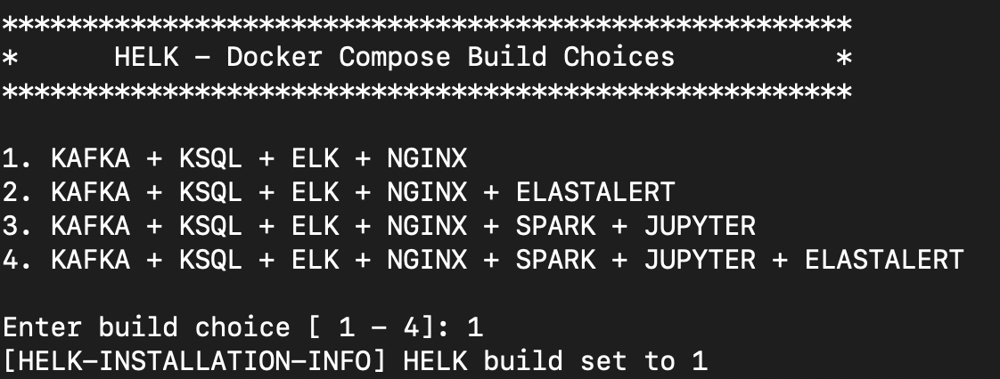
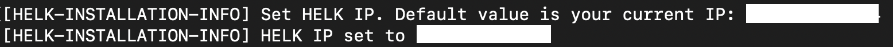
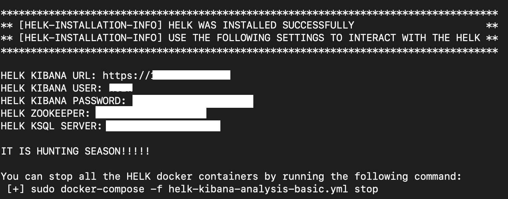
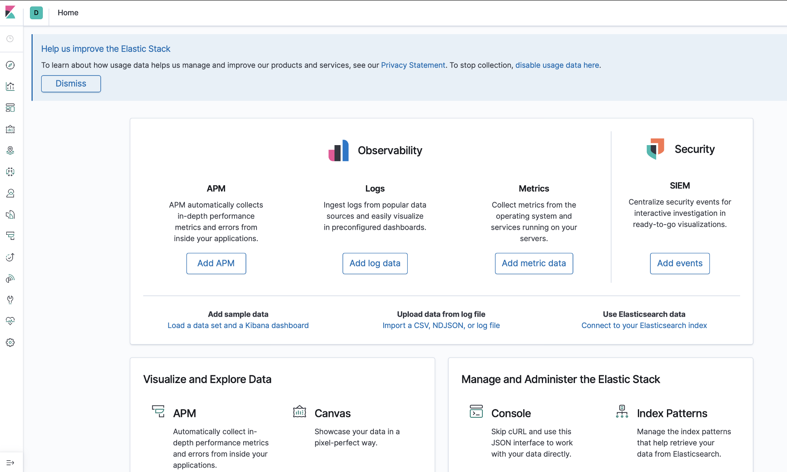

# HELK-automation
Scripts to automate HELK server standup in Digital Ocean and heartbeat on macOS. This is useful for blue and red teams who want to run offensive tools/tactics on macOS and view endpoint security logs in HELK to build detections. This also protects the HELK server by putting it behind a Digital Ocean cloud firewall and only allowing access to the IP(s) specified by the user during run.sh script execution.

This is building on the work that Antonio Piazza (@antman1P) did at https://antman1p-30185.medium.com/acting-red-seeing-blue-b04dd845c3dc by automating the server and client sides.

I wrote a blog post with more details here: [add URL]

## HELK Server Setup Steps:
**Preparation Steps:**

You will need a Digital Ocean account if you do not have one already. Once created, you will need to create an ssh key pair and then upload the public key to your Digital Ocean control panel (once logged in: **Settings → Security →Add ssh key**)

You will also need to create a Digital Ocean Personal Access Token (once logged in: **API → Tokens/Keys → Generate New Token**)

**After Digital Ocean Account Is Set Up, You Proceed With the HELK Server Setup Steps Below:**

This repo contains a folder named "HELK-Server". A summary of its contents is below:

- init.tf: This is the terraform config file for the HELK Server in Digital Ocean

- run.sh: This is the script that you run, which takes inputs from you to configure init.tf.

- 0098-all-filter.conf: This is a local copy of the HELK 0098-all-filter.conf file with an additional json section added for esf logs.

- orig/init-orig.tf: This is a clean init.tf copy that is used for initialization after everything is run

**Steps:**
1. Execute run.sh:

> chmod +x run.sh && ./run.sh

***run.sh script info***:
If terraform is not installed, it will attempt to install it for you (on Linux or MacOS)
You will then be prompted to enter the following info:

- name (inside of Digital Ocean) that you want to call your HELK server

- name (inside of Digital Ocean) that you want to call your Firewall that will protect the HELK server

- source IP address that you want to ssh into your HELK server from

- source IP address of the macOS host that you will send endpoint security logs from

- Digital Ocean Personal Access Token

- Name of your Digital Ocean public ssh key inside of your Digital Ocean control panel

- Path to the private key that pairs with the public ssh key in your Digital Ocean control panel

Once the HELK host is up:

- ssh into your new HELK host 
- run the helk_install.sh script:

> HELK/docker/./helk_install.sh

- Enter "1" for the "Enter build choice [ 1 - 4 ]" option

- Enter the IP address of your HELK Digital Ocean host for the "Set HELK IP" option

- Set the password for the "helk" user (this will be used later to login via the https site)

- It will then finish installation and stand up HELK. What's also nice is my run.sh script has terraform protect the new HELK server behind a DigitalOcean firewall so that only the source IPs specified can access it.

Now you can browse to your new HELK Server over https and login using the helk username and password you set:

Now that the HELK server is set up, next you can get the filebeat client and Endpoint Security tool set up on the macOS test client.

## macOS TEst Client Set Up

My HELK-automation github repo contains a "macOS-client" folder. This folder contains the following contents to help with automation on the macOS side:

- filebeat-setup.sh (downloads and runs filebeat on the macOS client. filebeat is dropped to the macOS-client directory). The script also prompts you for the IP address of your new HELK Digital Ocean server from above and takes that IP and puts it into the filebeat.yml file. Then filebeat is executed and pointed to the filebeat.yml file

- fb.yml (this is a local copy that the script uses to make variable replacements and copies over to filebeat.yml for filebeat execution. This contains the path to the esf.log file, which I set to /tmp/esf.log. This is where the endpoint security logs will be written to and shipped to HELK)

- ESF-setup.sh (this downloads Objective See's ProcessMonitor tool, which will be used to gather endpoint security events from the macOS test host)

1. run filebeat-setup.sh

2. run ESF-setup.sh - note: ProcessMonitor will require full disk access to capture endpoint security events. So once this script is done give ProcessMonitor.app full disk access and then:

> cd ProcessMonitor.app/Contents/MacOS

> sudo ./ProcessMonitor > /tmp/esf.log

That's it! Your macOS host should now be sending logs into your HELK Server in Digital Ocean!
